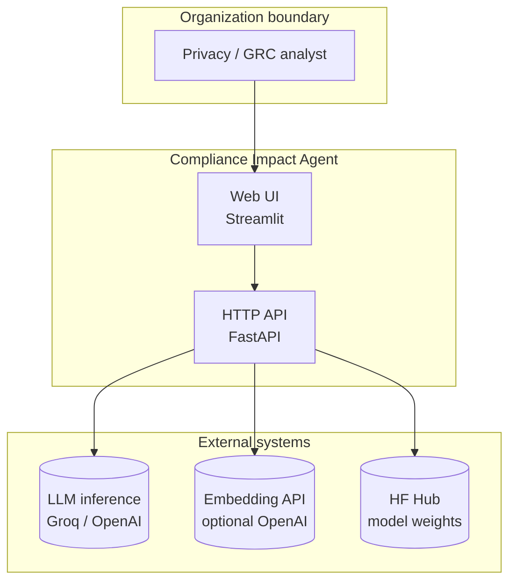
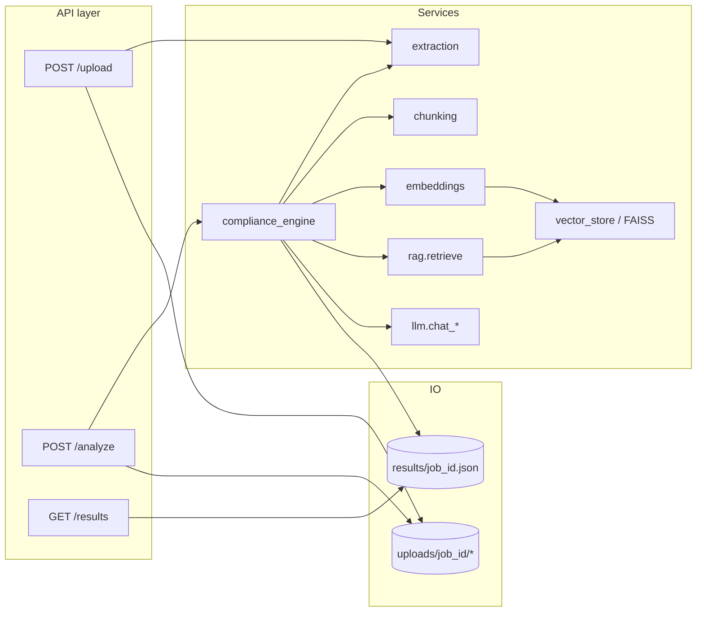
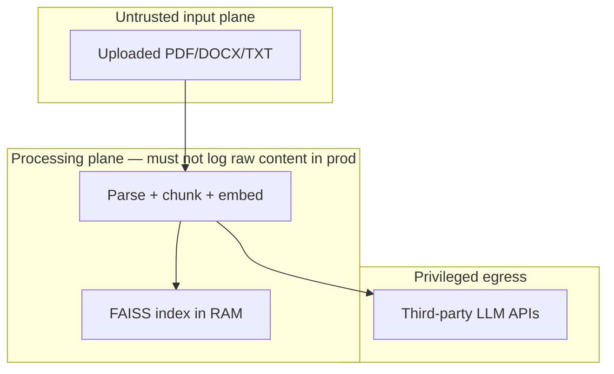
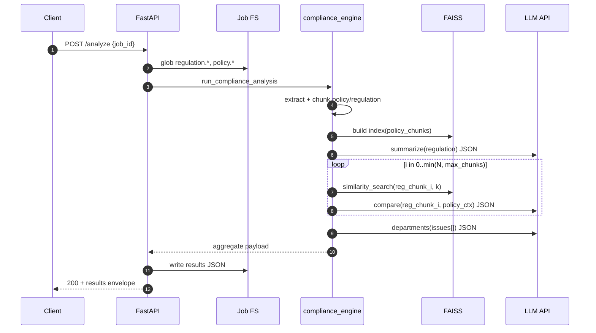
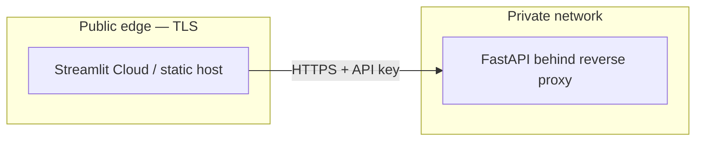
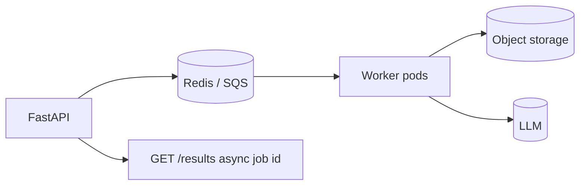

# Architecture — Advanced technical views

This document complements [README.md](README.md) with **architectural reasoning**: trust boundaries, deployment topologies, failure domains, and component responsibilities suitable for design reviews.

---

## 1. Design goals

| Goal | Mechanism |
|------|-----------|
| **Evidence-linked outputs** | Policy chunks retrieved into the LLM context for every regulation slice |
| **Provider portability** | OpenAI SDK + swappable `base_url` for Groq |
| **Cost-aware demos** | Local embeddings path avoids OpenAI vector charges |
| **Inspectable artifacts** | JSON snapshots under `data/results/` |

---

## 2. C4-style layering (conceptual)

### Level 1 — System context

### Level 2 — Containers

| Container | Technology | Responsibility |
|-----------|------------|----------------|
| **Presentation** | Streamlit (`frontend/app.py`) | Upload UX, metrics, tabular findings, JSON export |
| **Application API** | FastAPI (`backend/main.py`, `backend/api/routes.py`) | Multipart ingest, orchestrate analysis, serve cached JSON |
| **Analysis core** | Python services (`backend/services/*`) | Extract → chunk → embed → FAISS → RAG loops → aggregate |
| **Prompt library** | Text files (`backend/prompts/*.txt`) | Frozen prompt contracts versioned with code |
| **Local persistence** | Filesystem (`data/uploads`, `data/results`) | MVP durable store |

---

## 3. Component interaction (detailed)

---

## 4. Trust boundaries and data classification

| Data class | Typical content | At-rest (MVP) | In transit |
|------------|-----------------|---------------|------------|
| **Regulation text** | Statutory excerpts | `data/uploads/.../regulation.*` | HTTPS to LLM provider |
| **Policy text** | Internal privacy statement | Same job folder | HTTPS to LLM provider |
| **Embeddings** | Derived vectors | RAM only | — |
| **Results JSON** | Gaps + recommendations | `data/results/*.json` | HTTPS to Streamlit host |

**Important:** production systems should classify uploads as **confidential**, minimize retention, and avoid shipping raw documents to LLMs without **DPA** and **region** constraints—this MVP sends excerpts as required for analysis.

---

## 5. Sequence — successful analyze path

---

## 6. Sequence — degradation paths

| Stage | Failure | System behavior |
|-------|---------|-------------------|
| Upload | Bad extension / oversize | `400`, job dir removed |
| Analyze | Missing job dir | `404` |
| Summarize LLM | Non-JSON | Empty structured summary; chunk loop continues |
| Compare LLM | Non-JSON | Finding row with `ambiguous_clause` + snippet |
| Dept LLM | Non-JSON | Departments omitted (empty arrays) |
| Keys missing | Resolution throws | `503` / RuntimeError surfaced via HTTP |

---

## 7. Deployment topologies

### A. Developer laptop (default)

Streamlit and Uvicorn on `127.0.0.1`; `.env` on disk; single-user.

### B. Split UI and API (staging)

Rotate secrets in platform vault; restrict CORS to Streamlit origin.

### C. Future — async workers

Replace synchronous `/analyze` with **202 Accepted** + polling or Webhook.

---

## 8. Cross-cutting concerns checklist

| Concern | MVP | Hardening |
|---------|-----|-----------|
| **Observability** | Print / uvicorn logs | OpenTelemetry spans per stage + token counts |
| **Rate limits** | None | Per-tenant quotas on `/analyze` |
| **Multi-tenancy** | Single disk tree | Prefix uploads by `tenant_id` + KMS |
| **Model drift** | Prompts in Git | Prompt registry + evaluation harness |

---

## 9. Related reading

- [methodology.md](methodology.md) — formal RAG + scoring semantics  
- [README.md](README.md) — commands and env matrix  
